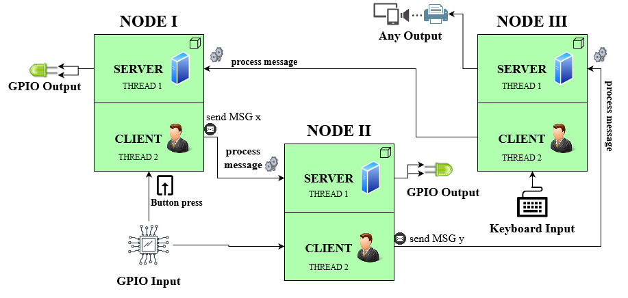

<h1 align="center">
    Cluster controller
</h1>

The goal of this project is to provide a meaningful demo into how a high-level protocol could easily be coded and used in a WiFi mesh IoT environment.

## About the project

In summary this is an IoT decentralized approach to a network of high-powered devices (Raspberry PIs in this case) bringing anonymity to the IoT world. It makes use of the B.A.T.M.A.N. project in creating the mesh using a kernel module operating on layer 2, more details [here](https://www.open-mesh.org/projects/batman-adv/wiki/Wiki). The application is essentially a demo protocol which uses the created mesh for message passing.




## Dependencies
The project has two main branches: `master` for compiling under generic Linux environment and `raspberry-pi` for compiling under Raspbian environment using the WiringPI library.\
Since the setup switches the WiFi mode to ad-hoc a separated/unused WiFi interface should be used.

```
boost
wiringPI
batman-adv
pthread
openssl
```

## Build and configuration

```bash
git clone https://github.com/dumitrupaul/cluster-controller.git
cd cluster-controller
make
```

The WiFi mesh interface and password needs to be changed along with the country code and ip range in `startup-script.sh`.\
The active configuration resides in `DeviceManager.xml` in which the devices and their interactions could be described. This is an important step since only one device can be the `currentDevice` and all devices should be present on every node configuration file.

After everything has been configured the startup script and demo can be started:
```bash
./startup-script.sh
./ClusterController
```

To use the GPIO functionalities you need to run the executable in auto mode: `./ClusterController auto=true`, otherwise it will use the CLI for input.\
The certificates and private keys found on this project are just examples, please generate and use your own.

## How to contribute

Contribution and feedback is encouraged and always welcome.
